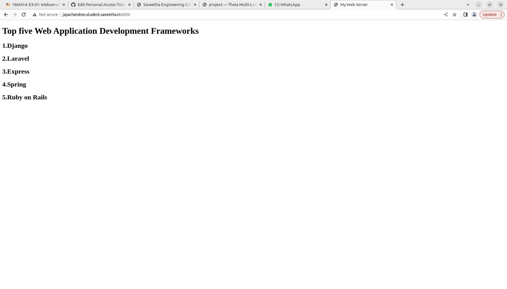
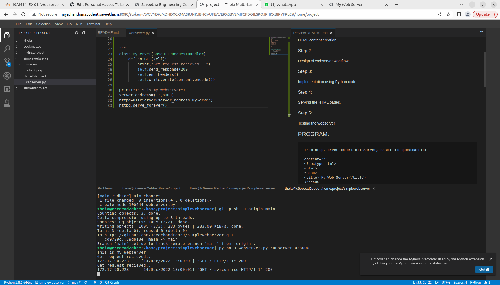

# Developing a Simple Webserver
## AIM:
To develop a simple webserver to display 5 framework lamguages

## DESIGN STEPS:
### Step 1: 
HTML content creation
### Step 2:
Design of webserver workflow
### Step 3:
Implementation using Python code
### Step 4:
Serving the HTML pages.
### Step 5:
Testing the webserver

## PROGRAM:
```
from http.server import HTTPServer, BaseHTTPRequestHandler

content="""
<!doctype html>
<html>
<head>
<title> My Web Server</title>
</head>
<body>
<h1> Top five Web Application Development Frameworks </h1>
<h2> 1.Django </h2>
<h2> 2.Laravel </h2>
<h2> 3.Express </h2>
<h2> 4.Spring </h2>
<h2> 5.Ruby on Rails </h2>

</body>
</html>


"""
class MyServer(BaseHTTPRequestHandler):
    def do_GET(self):
        print("Get request recieved...")
        self.send_response(200)
        self.end_headers()
        self.wfile.write(content.encode())

print("This is my Webserver")
server_address=('',8000)
httpd=HTTPServer(server_address,MyServer)
httpd.serve_forever()
```

## OUTPUT:
### client side

### server side


## RESULT:
The program is successfully created